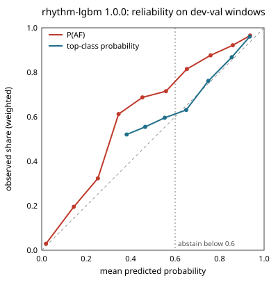

# rhythm-lgbm 1.0.0 (shipped rhythm model)

Lumen is a screening prototype, not a diagnosis.

## Intended use

Classifies 32-interval windows of pulse intervals from a fingertip reading as sinus, AF-like, or other. Part of a screening prototype, not a diagnosis; no emergency decision depends on this model alone.

This is the shipped rhythm model: the app loads it. The development ablation picked it (subject-level AUROC for AF vs not on dev-val; network minus rhythm-lgbm: -0.0006, 95% CI -0.0161 to 0.0156), so it ships per §11.3 (ADR 0031).

## Data

Intervals from the MIT-BIH AF, Long-Term AF, and CinC 2017 databases (records labeled noisy excluded) and premature-beat episodes from MIT-BIH Arrhythmia (labeled other), made to look like phone intervals with per-beat timing jitter (the training notes say how its σ was set), merged and split beats, and dropped premature beats. MIMIC PERform AF is never used for training or tuning. Ectopic beats in MIT-BIH Arrhythmia and Long-Term AF sinus stretches are labeled other, but the MIT-BIH AF beat files mark every beat normal, so its sinus episodes may still contain unmarked premature beats (some ectopy-as-sinus label noise).

Trained on: afdb, cinc2017, ltafdb, mitdb. Splits are by subject: no person appears in both development-train and development-validation.

Training notes, as written at training time:

- Windows: DSP-15 windows from 90 s readings; at most 400 windows per subject and label, chosen as whole readings with seed 20261026. 63862 dev-train, 19730 dev-val, and 294 premature-beat windows.
- Augmentation (dev-train only): augment_intervals (§11.3). Jitter σ ~ U(0, 40 ms) per reading. 40 ms is the robust per-beat SD of BUT PPG finger peaks vs ECG (worst case: 30 fps, includes pulse-transit variation). Real phone timestamps at M2 will refine it.
- Augmented intervals outside the DSP-9 range count as artifact spans, and windows are cut around them as the app would.
- Atypical-beat fraction neutralized in v1: ECG-derived training values don't match the app's PPG-derived DSP-9 values (Track C measured 31-42% atypical on sinus PPG). Every training and dev-val window carries 0.0 there, and no model uses it, so premature-beat information now comes only from interval irregularity.
- Training, early stopping, temperature scaling, and the LightGBM and logistic baselines weight windows so each label carries equal weight, each dataset equal weight within a label, and each subject equal weight within a dataset and label.
- Subject-level scores average P(AF) over a subject's windows, separately for its AF and non-AF windows. CinC 2017 has no subject IDs, so each recording counts as a subject.
- Dev-val numbers are optimistic: early stopping, temperature scaling, and τ_AF were all chosen on dev-val. The external test is the unbiased check.
- CinC 2017 makes up 1061 of the 1092 dev-val subjects, so it dominates the subject-level numbers and τ_AF; the by-dataset table shows each source alone.
- LightGBM tree settings (num_leaves 9) were set by the §11.9 500 KB file limit, not by accuracy.
- Ship rule (§11.3, subject-level AUROC for AF vs not on dev-val): rhythm-lgbm is the v1 rhythm model. Rhythm-Net and the logistic rule stay in the ablation table.
- Evaluation uses the same cap: dev-val is also limited to 400 windows per subject and label, chosen as whole readings, so long recordings count per person in every dev-val number.
- False AF on premature beats: augmented dev-val MIT-BIH Arrhythmia 'other' readings with at least one premature beat, called AF when the mean P(AF) is at least τ_AF. The sample is small (8 subjects, 294 windows), so its confidence interval is wide (§11.3 known failure mode).

## Development metrics

Development-validation subjects: 1092. Confidence intervals resample subjects.

| metric | estimate | 95% CI low | 95% CI high |
|---|---|---|---|
| windowAuroc | 0.9775503103827586 | 0.9457692214209981 | 0.9939971248180675 |
| windowSensitivity | 0.9666994750656168 | 0.9459326202129555 | 0.980344645190545 |
| windowSpecificity | 0.9252603784656007 | 0.8378172509928553 | 0.9787319406804861 |
| readingAuroc | 0.9734116230051189 | 0.929807175844496 | 0.994826232256911 |
| readingSensitivity | 0.9731481481481481 | 0.950579978905896 | 0.9843447344969195 |
| readingSpecificity | 0.9190957763236169 | 0.8167324795188293 | 0.980625286586619 |
| subjectAuroc | 0.9594481470749219 | 0.9378946969643597 | 0.9760663997961745 |
| subjectSensitivity | 0.8492063492063492 | 0.7868733089288557 | 0.9064765010421569 |
| subjectSpecificity | 0.9503042596348884 | 0.9362128972944576 | 0.9632277834525026 |
| subjectPpvAt1PctPrevalence | 0.14719949548503747 | 0.11730906018934407 | 0.1894215196747694 |
| subjectNpvAt1PctPrevalence | 0.9983997433302423 | 0.9977369152438429 | 0.9990044204210761 |
| subjectPpvAt5PctPrevalence | 0.4735108254640765 | 0.40914953477527605 | 0.549068427472067 |
| subjectNpvAt5PctPrevalence | 0.9917176265035952 | 0.9883194387971843 | 0.9948341611575405 |
| subjectPpvAt10PctPrevalence | 0.6550152730523753 | 0.5938084957075251 | 0.7199315010284618 |
| subjectNpvAt10PctPrevalence | 0.9826744302186643 | 0.9756569710609057 | 0.9891565795154811 |
| readingAbstainRate | 0.21770373999673362 | 0.17641014938488575 | 0.25275348929421093 |
| falseAfRatePrematureReadings | 0.30097087378640774 | 0.0851063829787234 | 0.611876241310824 |
| falseAfRatePrematureWindows | 0.35714285714285715 | 0.09141558441558444 | 0.6453333333333333 |

By dataset, at the same threshold:

| dataset | AF subjects | non-AF subjects | subject AUROC | subject sensitivity at τ_AF | subject specificity at τ_AF | window AUROC |
|---|---|---|---|---|---|---|
| afdb | 5 | 5 | 1.000 (1.000-1.000) | 1.000 (1.000-1.000) | 1.000 (1.000-1.000) | 0.993 (0.980-0.999) |
| cinc2017 | 104 | 957 | 0.953 (0.927-0.975) | 0.817 (0.740-0.890) | 0.952 (0.938-0.964) | 0.958 (0.939-0.973) |
| ltafdb | 17 | 15 | 0.976 (0.924-1.000) | 1.000 (1.000-1.000) | 0.867 (0.687-1.000) | 0.973 (0.931-0.997) |
| mitdb | 0 | 9 | undefined | undefined | 0.889 (0.667-1.000) | undefined |

## Ablation

The neural model ships only if it beats its classical baseline on held-out subjects.

| model | subject AUROC (95% CI) | subject sensitivity at τ_AF | subject specificity at τ_AF | window AUROC | τ_AF | false AF, premature-beat readings |
|---|---|---|---|---|---|---|
| rhythm-net | 0.959 (0.933-0.980) | 0.873 (0.815-0.925) | 0.950 (0.936-0.964) | 0.989 (0.978-0.995) | 0.2309 | 0.252 (0.050-0.558) |
| rhythm-lgbm | 0.959 (0.938-0.976) | 0.849 (0.787-0.906) | 0.950 (0.936-0.963) | 0.978 (0.946-0.994) | 0.2439 | 0.301 (0.085-0.612) |
| rhythm-logistic | 0.854 (0.814-0.891) | 0.500 (0.409-0.587) | 0.950 (0.937-0.963) | 0.915 (0.830-0.967) | 0.6121 | 0.233 (0.000-0.528) |

## Calibration

- sourceSha256: 032910f802f2dadb06748a4d5b85bb9f7fc5685ece6830c414d3b7350b16ae3f
- measuredBy: python -m train.rhythm_calibration, after training, from the frozen model
- devValWindowsSha256: 054d1533c3a64489c5d4b1ec5671f031cbd2a5a04c5bbfddea298cc8e426a6a9
- method: none: the model's own class probabilities, not recalibrated
- devValWeightedNll: 0.581247087908458
- windowExpectedCalibrationErrorAf: 0.034711762992692866
- windowExpectedCalibrationErrorTop: 0.025723626873953142

Windows are weighted as in training (each label equal, then each dataset, then each subject), so the observed shares hold for that balance, not for any real-world prevalence. Points on the diagonal are calibrated; points above it mean the model is underconfident. The app abstains when a reading's top-class probability is below 0.6.

P(AF) (share of windows that are AF):

| bin | windows | mean predicted | observed | observed minus predicted |
|---|---|---|---|---|
| 0.0-0.1 | 12059 | 0.019 | 0.029 | +0.010 |
| 0.1-0.2 | 597 | 0.144 | 0.195 | +0.051 |
| 0.2-0.3 | 338 | 0.253 | 0.323 | +0.070 |
| 0.3-0.4 | 240 | 0.346 | 0.612 | +0.267 |
| 0.4-0.5 | 254 | 0.453 | 0.687 | +0.234 |
| 0.5-0.6 | 320 | 0.559 | 0.715 | +0.156 |
| 0.6-0.7 | 384 | 0.653 | 0.815 | +0.162 |
| 0.7-0.8 | 661 | 0.759 | 0.876 | +0.117 |
| 0.8-0.9 | 1708 | 0.859 | 0.921 | +0.062 |
| 0.9-1.0 | 3169 | 0.937 | 0.965 | +0.028 |

top-class probability (share of windows whose top class is right):

| bin | windows | mean predicted | observed | observed minus predicted |
|---|---|---|---|---|
| 0.3-0.4 | 33 | 0.382 | 0.520 | +0.138 |
| 0.4-0.5 | 590 | 0.465 | 0.555 | +0.089 |
| 0.5-0.6 | 3797 | 0.553 | 0.596 | +0.042 |
| 0.6-0.7 | 4023 | 0.650 | 0.631 | -0.019 |
| 0.7-0.8 | 2972 | 0.749 | 0.761 | +0.012 |
| 0.8-0.9 | 4826 | 0.855 | 0.868 | +0.013 |
| 0.9-1.0 | 3489 | 0.935 | 0.960 | +0.025 |

## External test

Dataset: mimic-perform-af. Not run yet. Run once per model version, only after the owner approves (need-human).

## Limitations

- Frequent premature beats make intervals irregular in every reading, so they can trigger repeated false irregular results that the 2-of-3 rule does not catch.
- Trained on ECG intervals adapted to look like phone intervals, not on phone recordings.
- False-AF rate on augmented premature-beat readings (dev-val): 0.301 (95% CI 0.085-0.612).
- Reading abstain rate (top probability below 0.6) on dev-val: 0.218 (95% CI 0.176-0.253).

## What the app shows when the model abstains

When the top probability is below the abstain threshold in the manifest (abstainBelow), the app shows "Couldn't tell — please retake." If the model fails to load, the classical baseline runs instead and the result card says "basic analysis."
