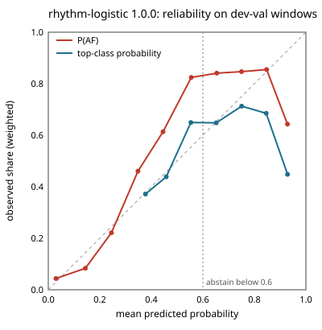

# rhythm-logistic 1.0.0 (ablation model, not shipped)

Lumen is a screening prototype, not a diagnosis.

## Intended use

Classifies 32-interval windows of pulse intervals from a fingertip reading as sinus, AF-like, or other. Part of a screening prototype, not a diagnosis; no emergency decision depends on this model alone.

This is an ablation model and does not ship; the app loads rhythm-lgbm for the rhythm family (ADR 0031). On development subjects it did not beat rhythm-lgbm (subject-level AUROC for AF vs not on dev-val).

## Data

Intervals from the MIT-BIH AF, Long-Term AF, and CinC 2017 databases (records labeled noisy excluded) and premature-beat episodes from MIT-BIH Arrhythmia (labeled other), made to look like phone intervals with per-beat timing jitter (the training notes say how its σ was set), merged and split beats, and dropped premature beats. MIMIC PERform AF is never used for training or tuning. Ectopic beats in MIT-BIH Arrhythmia and Long-Term AF sinus stretches are labeled other, but the MIT-BIH AF beat files mark every beat normal, so its sinus episodes may still contain unmarked premature beats (some ectopy-as-sinus label noise).

Trained on: afdb, cinc2017, ltafdb, mitdb. Splits are by subject: no person appears in both development-train and development-validation.

Training notes, as written at training time:

- Windows: DSP-15 windows from 90 s readings; at most 400 windows per subject and label, chosen as whole readings with seed 20261026. 63862 dev-train, 19730 dev-val, and 294 premature-beat windows.
- Augmentation (dev-train only): augment_intervals (§11.3). Jitter σ ~ U(0, 40 ms) per reading. 40 ms is the robust per-beat SD of BUT PPG finger peaks vs ECG (worst case: 30 fps, includes pulse-transit variation). Real phone timestamps at M2 will refine it.
- Augmented intervals outside the DSP-9 range count as artifact spans, and windows are cut around them as the app would.
- Atypical-beat fraction neutralized in v1: ECG-derived training values don't match the app's PPG-derived DSP-9 values (Track C measured 31-42% atypical on sinus PPG). Every training and dev-val window carries 0.0 there, and no model uses it, so premature-beat information now comes only from interval irregularity.
- Training, early stopping, temperature scaling, and the LightGBM and logistic baselines weight windows so each label carries equal weight, each dataset equal weight within a label, and each subject equal weight within a dataset and label.
- Subject-level scores average P(AF) over a subject's windows, separately for its AF and non-AF windows. CinC 2017 has no subject IDs, so each recording counts as a subject.
- Dev-val numbers are optimistic: early stopping, temperature scaling, and τ_AF were all chosen on dev-val. The external test is the unbiased check.
- CinC 2017 makes up 1061 of the 1092 dev-val subjects, so it dominates the subject-level numbers and τ_AF; the by-dataset table shows each source alone.
- LightGBM tree settings (num_leaves 9) were set by the §11.9 500 KB file limit, not by accuracy.
- Ship rule (§11.3, subject-level AUROC for AF vs not on dev-val): rhythm-lgbm is the v1 rhythm model. Rhythm-Net and the logistic rule stay in the ablation table.
- Evaluation uses the same cap: dev-val is also limited to 400 windows per subject and label, chosen as whole readings, so long recordings count per person in every dev-val number.
- False AF on premature beats: augmented dev-val MIT-BIH Arrhythmia 'other' readings with at least one premature beat, called AF when the mean P(AF) is at least τ_AF. The sample is small (8 subjects, 294 windows), so its confidence interval is wide (§11.3 known failure mode).

## Development metrics

Development-validation subjects: 1092. Confidence intervals resample subjects.

| metric | estimate | 95% CI low | 95% CI high |
|---|---|---|---|
| windowAuroc | 0.9153695870713827 | 0.8297790513850332 | 0.9673075645543703 |
| windowSensitivity | 0.6409120734908137 | 0.539785856608795 | 0.7370638073123329 |
| windowSpecificity | 0.9217397682264926 | 0.8278188759633637 | 0.978991647758286 |
| readingAuroc | 0.91162998215348 | 0.8116445769622426 | 0.97073833448085 |
| readingSensitivity | 0.6342592592592593 | 0.4901604423297169 | 0.7648918081103587 |
| readingSpecificity | 0.9153281776720206 | 0.8083499460341397 | 0.9811336366810393 |
| subjectAuroc | 0.8544946714317911 | 0.8144514856896532 | 0.8907831374057762 |
| subjectSensitivity | 0.5 | 0.40869565217391307 | 0.586961507778221 |
| subjectSpecificity | 0.9503042596348884 | 0.936733411957748 | 0.9633046188880696 |
| subjectPpvAt1PctPrevalence | 0.09225299401197601 | 0.06858324805800015 | 0.1275891970843975 |
| subjectNpvAt1PctPrevalence | 0.9947134768808441 | 0.9937566918187641 | 0.9956393531393329 |
| subjectPpvAt5PctPrevalence | 0.34620786516853924 | 0.2772832881096525 | 0.43247412577948297 |
| subjectNpvAt5PctPrevalence | 0.9730542195015304 | 0.9683023344031703 | 0.977688389749323 |
| subjectPpvAt10PctPrevalence | 0.5278372591006423 | 0.4475033772001718 | 0.6166730167396902 |
| subjectNpvAt10PctPrevalence | 0.9447680932108447 | 0.935359326467171 | 0.9540371616474694 |
| readingAbstainRate | 0.20316838151233055 | 0.16237996255708198 | 0.24736733910163652 |
| falseAfRatePrematureReadings | 0.23300970873786409 | 0.0 | 0.5283018867924528 |
| falseAfRatePrematureWindows | 0.2925170068027211 | 0.0 | 0.6038781163434903 |

By dataset, at the same threshold:

| dataset | AF subjects | non-AF subjects | subject AUROC | subject sensitivity at τ_AF | subject specificity at τ_AF | window AUROC |
|---|---|---|---|---|---|---|
| afdb | 5 | 5 | 1.000 (1.000-1.000) | 0.800 (0.400-1.000) | 1.000 (1.000-1.000) | 0.972 (0.949-0.993) |
| cinc2017 | 104 | 957 | 0.834 (0.785-0.879) | 0.462 (0.364-0.558) | 0.951 (0.936-0.964) | 0.829 (0.781-0.873) |
| ltafdb | 17 | 15 | 0.871 (0.688-1.000) | 0.647 (0.412-0.882) | 0.867 (0.687-1.000) | 0.906 (0.792-0.979) |
| mitdb | 0 | 9 | undefined | undefined | 1.000 (1.000-1.000) | undefined |

## Ablation

The neural model ships only if it beats its classical baseline on held-out subjects.

| model | subject AUROC (95% CI) | subject sensitivity at τ_AF | subject specificity at τ_AF | window AUROC | τ_AF | false AF, premature-beat readings |
|---|---|---|---|---|---|---|
| rhythm-net | 0.959 (0.933-0.980) | 0.873 (0.815-0.925) | 0.950 (0.936-0.964) | 0.989 (0.978-0.995) | 0.2309 | 0.252 (0.050-0.558) |
| rhythm-lgbm | 0.959 (0.938-0.976) | 0.849 (0.787-0.906) | 0.950 (0.936-0.963) | 0.978 (0.946-0.994) | 0.2439 | 0.301 (0.085-0.612) |
| rhythm-logistic | 0.854 (0.814-0.891) | 0.500 (0.409-0.587) | 0.950 (0.937-0.963) | 0.915 (0.830-0.967) | 0.6121 | 0.233 (0.000-0.528) |

## Calibration

- sourceSha256: 81d8654250faca9bb80031657ac529b7aecf5e31954806465d215b52a13fb02c
- measuredBy: python -m train.rhythm_logistic, refitted on the window cache of the rhythm-lgbm run
- method: none: the model's own class probabilities, not recalibrated
- devValWeightedNll: 0.890379834331592
- windowExpectedCalibrationErrorAf: 0.06743692702427614
- windowExpectedCalibrationErrorTop: 0.10085151180283958

Windows are weighted as in training (each label equal, then each dataset, then each subject), so the observed shares hold for that balance, not for any real-world prevalence. Points on the diagonal are calibrated; points above it mean the model is underconfident. The app abstains when a reading's top-class probability is below 0.6.

P(AF) (share of windows that are AF):

| bin | windows | mean predicted | observed | observed minus predicted |
|---|---|---|---|---|
| 0.0-0.1 | 8727 | 0.030 | 0.044 | +0.014 |
| 0.1-0.2 | 2169 | 0.144 | 0.083 | -0.060 |
| 0.2-0.3 | 1238 | 0.245 | 0.221 | -0.024 |
| 0.3-0.4 | 823 | 0.348 | 0.460 | +0.112 |
| 0.4-0.5 | 736 | 0.445 | 0.613 | +0.168 |
| 0.5-0.6 | 941 | 0.555 | 0.824 | +0.269 |
| 0.6-0.7 | 1188 | 0.654 | 0.841 | +0.187 |
| 0.7-0.8 | 1459 | 0.750 | 0.847 | +0.097 |
| 0.8-0.9 | 1636 | 0.847 | 0.855 | +0.008 |
| 0.9-1.0 | 813 | 0.928 | 0.643 | -0.285 |

top-class probability (share of windows whose top class is right):

| bin | windows | mean predicted | observed | observed minus predicted |
|---|---|---|---|---|
| 0.3-0.4 | 312 | 0.377 | 0.372 | -0.005 |
| 0.4-0.5 | 1714 | 0.458 | 0.438 | -0.020 |
| 0.5-0.6 | 2518 | 0.553 | 0.649 | +0.096 |
| 0.6-0.7 | 3210 | 0.652 | 0.648 | -0.004 |
| 0.7-0.8 | 4563 | 0.751 | 0.713 | -0.038 |
| 0.8-0.9 | 5344 | 0.846 | 0.685 | -0.161 |
| 0.9-1.0 | 2069 | 0.929 | 0.448 | -0.481 |

## External test

Dataset: mimic-perform-af. Not run yet. Run once per model version, only after the owner approves (need-human).

## Limitations

- Frequent premature beats make intervals irregular in every reading, so they can trigger repeated false irregular results that the 2-of-3 rule does not catch.
- Trained on ECG intervals adapted to look like phone intervals, not on phone recordings.
- False-AF rate on augmented premature-beat readings (dev-val, 8 subjects, 294 windows): 0.233 (95% CI 0.000-0.528).
- Reading abstain rate (top probability below 0.6) on dev-val: 0.203 (95% CI 0.162-0.247).

## What the app shows when the model abstains

When the top probability is below the abstain threshold in the manifest (abstainBelow), the app shows "Couldn't tell — please retake." If the model fails to load, the classical baseline runs instead and the result card says "basic analysis."
