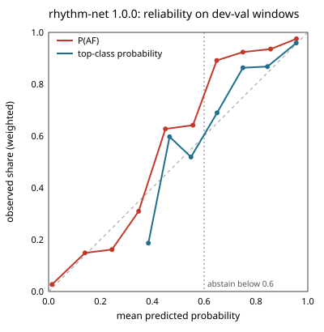

# rhythm-net 1.0.0 (ablation model, not shipped)

Lumen is a screening prototype, not a diagnosis.

## Intended use

Classifies 32-interval windows of pulse intervals from a fingertip reading as sinus, AF-like, or other. Part of a screening prototype, not a diagnosis; no emergency decision depends on this model alone.

This is an ablation model and does not ship; the app loads rhythm-lgbm for the rhythm family (ADR 0031). On development subjects it did not beat rhythm-lgbm (subject-level AUROC for AF vs not on dev-val).

## Data

Intervals from the MIT-BIH AF, Long-Term AF, and CinC 2017 databases (records labeled noisy excluded) and premature-beat episodes from MIT-BIH Arrhythmia (labeled other), made to look like phone intervals with per-beat timing jitter (the training notes say how its σ was set), merged and split beats, and dropped premature beats. MIMIC PERform AF is never used for training or tuning. Ectopic beats in MIT-BIH Arrhythmia and Long-Term AF sinus stretches are labeled other, but the MIT-BIH AF beat files mark every beat normal, so its sinus episodes may still contain unmarked premature beats (some ectopy-as-sinus label noise).

Trained on: afdb, cinc2017, ltafdb, mitdb. Splits are by subject: no person appears in both development-train and development-validation.

Training notes, as written at training time:

- Windows: DSP-15 windows from 90 s readings; at most 400 windows per subject and label, chosen as whole readings with seed 20261026. 63862 dev-train, 19730 dev-val, and 294 premature-beat windows.
- Augmentation (dev-train only): augment_intervals (§11.3). Jitter σ ~ U(0, 40 ms) per reading. 40 ms is the robust per-beat SD of BUT PPG finger peaks vs ECG (worst case: 30 fps, includes pulse-transit variation). Real phone timestamps at M2 will refine it.
- Augmented intervals outside the DSP-9 range count as artifact spans, and windows are cut around them as the app would.
- Atypical-beat fraction neutralized in v1: ECG-derived training values don't match the app's PPG-derived DSP-9 values (Track C measured 31-42% atypical on sinus PPG). Every training and dev-val window carries 0.0 there, and no model uses it, so premature-beat information now comes only from interval irregularity.
- Training, early stopping, temperature scaling, and the LightGBM and logistic baselines weight windows so each label carries equal weight, each dataset equal weight within a label, and each subject equal weight within a dataset and label.
- Subject-level scores average P(AF) over a subject's windows, separately for its AF and non-AF windows. CinC 2017 has no subject IDs, so each recording counts as a subject.
- Dev-val numbers are optimistic: early stopping, temperature scaling, and τ_AF were all chosen on dev-val. The external test is the unbiased check.
- CinC 2017 makes up 1061 of the 1092 dev-val subjects, so it dominates the subject-level numbers and τ_AF; the by-dataset table shows each source alone.
- LightGBM tree settings (num_leaves 9) were set by the §11.9 500 KB file limit, not by accuracy.
- Ship rule (§11.3, subject-level AUROC for AF vs not on dev-val): rhythm-lgbm is the v1 rhythm model. Rhythm-Net and the logistic rule stay in the ablation table.
- Evaluation uses the same cap: dev-val is also limited to 400 windows per subject and label, chosen as whole readings, so long recordings count per person in every dev-val number.
- False AF on premature beats: augmented dev-val MIT-BIH Arrhythmia 'other' readings with at least one premature beat, called AF when the mean P(AF) is at least τ_AF. The sample is small (8 subjects, 294 windows), so its confidence interval is wide (§11.3 known failure mode).

## Development metrics

Development-validation subjects: 1092. Confidence intervals resample subjects.

| metric | estimate | 95% CI low | 95% CI high |
|---|---|---|---|
| windowAuroc | 0.9886276329016889 | 0.978003062984246 | 0.995346599962561 |
| windowSensitivity | 0.9735892388451444 | 0.9586206085765018 | 0.9842667535877344 |
| windowSpecificity | 0.9533519143318175 | 0.8949181659270351 | 0.9845299860542137 |
| readingAuroc | 0.9869891158261175 | 0.9715516632822233 | 0.9954562485956754 |
| readingSensitivity | 0.975925925925926 | 0.9577859915894159 | 0.9857947126855491 |
| readingSpecificity | 0.9474519135435256 | 0.8780919561625227 | 0.9835889010049355 |
| subjectAuroc | 0.9588525065198493 | 0.9328594414525034 | 0.9795956003580008 |
| subjectSensitivity | 0.873015873015873 | 0.8148073476702509 | 0.924812030075188 |
| subjectSpecificity | 0.9503042596348884 | 0.9363389818860349 | 0.9639212303393383 |
| subjectPpvAt1PctPrevalence | 0.15070461284504624 | 0.11993467099591484 | 0.19730148774137074 |
| subjectNpvAt1PctPrevalence | 0.9986520748529082 | 0.9980413178642551 | 0.99920065546954 |
| subjectPpvAt5PctPrevalence | 0.480408918969198 | 0.415234354662463 | 0.561544976164169 |
| subjectNpvAt5PctPrevalence | 0.9930162367184104 | 0.9898777145127577 | 0.995848965265378 |
| subjectPpvAt10PctPrevalence | 0.6612366332166849 | 0.5998514790338062 | 0.7300052150974938 |
| subjectNpvAt10PctPrevalence | 0.9853700245007577 | 0.9788683974314668 | 0.9912769374892773 |
| readingAbstainRate | 0.20088192062714355 | 0.16002511005097253 | 0.2358101950563215 |
| falseAfRatePrematureReadings | 0.2524271844660194 | 0.05040966386554624 | 0.5584511077158135 |
| falseAfRatePrematureWindows | 0.282312925170068 | 0.04285714285714286 | 0.5355311475409836 |

By dataset, at the same threshold:

| dataset | AF subjects | non-AF subjects | subject AUROC | subject sensitivity at τ_AF | subject specificity at τ_AF | window AUROC |
|---|---|---|---|---|---|---|
| afdb | 5 | 5 | 1.000 (1.000-1.000) | 1.000 (1.000-1.000) | 1.000 (1.000-1.000) | 0.994 (0.981-0.999) |
| cinc2017 | 104 | 957 | 0.952 (0.921-0.976) | 0.846 (0.772-0.913) | 0.950 (0.935-0.963) | 0.959 (0.938-0.975) |
| ltafdb | 17 | 15 | 1.000 (1.000-1.000) | 1.000 (1.000-1.000) | 0.933 (0.786-1.000) | 0.988 (0.975-0.998) |
| mitdb | 0 | 9 | undefined | undefined | 1.000 (1.000-1.000) | undefined |

## Ablation

The neural model ships only if it beats its classical baseline on held-out subjects.

| model | subject AUROC (95% CI) | subject sensitivity at τ_AF | subject specificity at τ_AF | window AUROC | τ_AF | false AF, premature-beat readings |
|---|---|---|---|---|---|---|
| rhythm-net | 0.959 (0.933-0.980) | 0.873 (0.815-0.925) | 0.950 (0.936-0.964) | 0.989 (0.978-0.995) | 0.2309 | 0.252 (0.050-0.558) |
| rhythm-lgbm | 0.959 (0.938-0.976) | 0.849 (0.787-0.906) | 0.950 (0.936-0.963) | 0.978 (0.946-0.994) | 0.2439 | 0.301 (0.085-0.612) |
| rhythm-logistic | 0.854 (0.814-0.891) | 0.500 (0.409-0.587) | 0.950 (0.937-0.963) | 0.915 (0.830-0.967) | 0.6121 | 0.233 (0.000-0.528) |

## Calibration

- sourceSha256: 8fc3ae9e0439fb3ac66f8100cd8ae5cb3b9e5550131cf742e5a7c63b0ad1231f
- measuredBy: python -m train.rhythm_calibration, after training, from the frozen model
- devValWindowsSha256: 054d1533c3a64489c5d4b1ec5671f031cbd2a5a04c5bbfddea298cc8e426a6a9
- method: temperature scaling on dev-val windows, weighted by label, dataset, and subject
- temperature: 1.0166082382202148
- devValWeightedNllBefore: 0.5387269544082475
- devValWeightedNll: 0.5386709788078742
- windowExpectedCalibrationErrorAf: 0.03061597739582304
- windowExpectedCalibrationErrorTop: 0.04525330998538534

Windows are weighted as in training (each label equal, then each dataset, then each subject), so the observed shares hold for that balance, not for any real-world prevalence. Points on the diagonal are calibrated; points above it mean the model is underconfident. The app abstains when a reading's top-class probability is below 0.6.

P(AF) (share of windows that are AF):

| bin | windows | mean predicted | observed | observed minus predicted |
|---|---|---|---|---|
| 0.0-0.1 | 12627 | 0.013 | 0.027 | +0.014 |
| 0.1-0.2 | 435 | 0.140 | 0.149 | +0.009 |
| 0.2-0.3 | 266 | 0.245 | 0.162 | -0.083 |
| 0.3-0.4 | 195 | 0.347 | 0.310 | -0.038 |
| 0.4-0.5 | 169 | 0.451 | 0.627 | +0.177 |
| 0.5-0.6 | 220 | 0.557 | 0.642 | +0.085 |
| 0.6-0.7 | 283 | 0.649 | 0.892 | +0.243 |
| 0.7-0.8 | 548 | 0.750 | 0.924 | +0.175 |
| 0.8-0.9 | 1164 | 0.856 | 0.936 | +0.079 |
| 0.9-1.0 | 3823 | 0.956 | 0.975 | +0.019 |

top-class probability (share of windows whose top class is right):

| bin | windows | mean predicted | observed | observed minus predicted |
|---|---|---|---|---|
| 0.3-0.4 | 24 | 0.385 | 0.187 | -0.198 |
| 0.4-0.5 | 324 | 0.467 | 0.597 | +0.130 |
| 0.5-0.6 | 3113 | 0.549 | 0.519 | -0.030 |
| 0.6-0.7 | 3686 | 0.650 | 0.690 | +0.040 |
| 0.7-0.8 | 4324 | 0.750 | 0.863 | +0.114 |
| 0.8-0.9 | 3835 | 0.844 | 0.868 | +0.024 |
| 0.9-1.0 | 4424 | 0.955 | 0.959 | +0.004 |

## External test

Dataset: mimic-perform-af. Not run yet. Run once per model version, only after the owner approves (need-human).

## Limitations

- Frequent premature beats make intervals irregular in every reading, so they can trigger repeated false irregular results that the 2-of-3 rule does not catch.
- Trained on ECG intervals adapted to look like phone intervals, not on phone recordings.
- False-AF rate on augmented premature-beat readings (dev-val): 0.252 (95% CI 0.050-0.558).
- Reading abstain rate (top probability below 0.6) on dev-val: 0.201 (95% CI 0.160-0.236).

## What the app shows when the model abstains

When the top probability is below the abstain threshold in the manifest (abstainBelow), the app shows "Couldn't tell — please retake." If the model fails to load, the classical baseline runs instead and the result card says "basic analysis."
